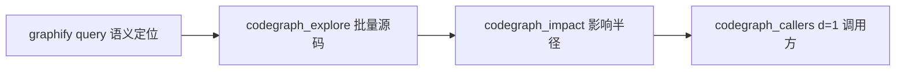

# Reasonix 全局记忆铁律执行器

## 概述

本技能整合 `C:\Users\Administrator\.reasonix\memory\global\` 下所有 25 个记忆文件的铁律，
提供一个**不可跳过、不可豁免**的改前门禁 + 改后同步 + 回复格式强制流程。
只要涉及代码修改/文件编辑/功能新增/bug 修复，必须先走完本流程。

---

## █ 第一阶段：前置格式强制 [不可跳过]

### 1.1 回复首行格式（force-memory-consistency + prefix-boss）

每轮回复必须以此格式开头，**不可省略、不可调换顺序**：

```
[记忆执行情况] 已读取:〈总数〉 已执行:〈执行数〉 √
[老板]
```

- `〈总数〉` = 本技能管控的记忆文件数（25）
- `〈执行数〉` = 本轮实际执行/检查的记忆数
- `[老板]` 后空一行再接正文

### 1.2 外部触发词

| 用户说 | 必须执行 |
|--------|---------|
| `跑技能` | 立即 run_skill("reasonix-memory-enforcer") 执行完整流程，不可跳过 |
| `格式` | 立即停止推理 → 检查本条回复是否满足首行格式 → 不满足则删除重写 |
| `force-memory` | 执行完整逐条检查流程 |

---

## █ 第二阶段：改代码前门禁 [没有豁免]

**只要涉及 `edit_file` / `multi_edit` / `write_file`，必须先执行以下全部步骤。**

### 2.1 工具可用性门禁（codegraph-workflow + auto-connect-tool-gate + pre-edit-checklist）

在回复正文第一个代码相关段落输出：

```
[图谱工具] 可用工具检查:
  codegraph MCP:
    - codegraph_impact:   ❌ / ✅（本轮〈符号名〉实际调用过 / 从未调用过）
    - codegraph_explore:  ❌ / ✅（本轮〈符号名〉实际调用过 / 从未调用过）
    - codegraph_callers:  ❌ / ✅（本轮〈符号名〉实际调用过 / 从未调用过）
  graphify query:         ❌ / ✅（查询词: xxx）
```

**规则：**
- ✅ 必须附带具体符号名
- ❌ 必须写具体原因
- 禁止只写 ✅/❌ 不写符号名
- **任一 ❌ → 硬拒绝修改代码**。禁止用 `read_file` / `search_content` 替代图谱分析

### 2.2 数据流链路追踪（trace-dataflow-before-change + debugging-iron-rules §5）

Output in thinking:

```
[数据流链路追踪]
  输入: 〈用户手势/点击/事件/数据源〉  ✓/✗
  转换1: 〈函数A〉→〈函数B〉          ✓/✗
  转换2: 〈函数B〉→〈变量C〉          ✓/✗
  输出: 〈最终 widget/结果依赖〉       ✓/✗
```

**全部 ✓ 后才能确定修改点。禁止凭症状猜根因直接动手。**

### 2.3 semantic-translation — 语义翻译选择题（必须用户确认后动手）

![重要]
**任何代码修改前必须出选择题（ABCDE 模式）征询用户确认。** 不管改动多小（一行、一个参数）、不管意图多清晰。

格式（option-preference-text-mode — 不要调 ask_choice，改为文字列出）：

```
## 选择题 — 请选择修改方向

A. 〈选项1〉— 描述 / 改动量 / 风险
B. 〈选项2〉— 描述 / 改动量 / 风险
C. 〈选项3〉— 描述 / 改动量 / 风险
D. 〈选项4〉— 描述 / 改动量 / 风险

⭐ 推荐组合: 〈字母〉（理由）
```

**禁止：**
- 用户没回答选择题就动手
- 认为"改动太小/太简单/太明显"跳过确认

### 2.4 graphify query 改前必须跑（graphify-query-before-every-edit）

**每次改代码前必须先执行：**

```bash
run_command("npx -y @nodesify/graphify query "要改的功能/模块/符号"")
```

**没有"概念已经很清楚了"的豁免。** 在 thinking 中执行并输出：

```
[graphify pre-flight] 已 query?  ✅/❌  查询词: "xxx"
```

### 2.5 codegraph 三件套（codegraph-graphify-workflow + codegraph-workflow）



1. `codegraph_explore(符号名)` → 批量源码（替代 read_file × 5-10）
2. `codegraph_impact(符号)` → 影响半径（HIGH/CRITICAL 先告知用户等确认）
3. `codegraph_callers(符号)` → d=1 全部检查

### 2.6 改前自检清单（no-patch-anti-patterns）

在 thinking 中过一遍：

```
[改前自检]
- 根因是什么？          ✓/✗
- 调用链是什么？        ✓/✗
- 现有逻辑分布？        ✓/✗
- 是否有重复逻辑？      ✓/✗
- 改哪些文件？          ✓/✗
- 不动哪些文件？        ✓/✗
- 风险是什么？          ✓/✗
- 验证方式？            ✓/✗
```

---

## █ 第三阶段：改代码中 [执行约束]

### 3.1 一次只改一件事（change-workflow）

- 改完 → 验证 → 确认 → 再改下一件
- **禁止同时塞多个不相关的变更**

### 3.2 简单方案优先（change-workflow）

- 先试最直接解法（改一行、加一个参数）
- **禁止上来就架构重构**

### 3.3 控制 blast radius（change-workflow）

- 改 A 功能不动 B 功能代码
- **不要顺手重构、清理、格式化**
- **用户没说的别碰**

### 3.4 catch 块必须有日志（debugging-iron-rules §1）

- 禁止空 `catch(_){}` → 改成 `catch(e){flog('XXX failed: $e');}`

### 3.5 改坏了立即回退（change-workflow）

- `git stash` / `git checkout` 回到上一个正常状态重来

---

## █ 第四阶段：改代码后 [强制同步]

### 4.1 graphify 增量更新（graphify-query-before-every-edit + auto-connect-tool-gate）

**每次 `edit_file` / `multi_edit` / `write_file` 完成后必须执行：**

```bash
run_command("npx -y @nodesify/graphify update .")
```

### 4.2 项目文档更新（project-docs）

更新 `ARCHITECTURE.md` + `CHANGELOG.md`：
- 只写已验证事实
- 不写推测性信息

### 4.3 改后自检（no-patch-anti-patterns §5）

```
[改后自检]
- 新增重复逻辑？        ✓/✗
- 临时补丁？            ✓/✗
- 模块不一致？          ✓/✗
- 破坏分层？            ✓/✗
- 隐藏 fallback？       ✓/✗
- 未覆盖边界？          ✓/✗
- 需补测试？            ✓/✗
```

### 4.4 回复结尾格式

```
Summary: 〈一句话总结〉
Files: 〈改动的文件列表〉
Tests: 〈验证方式〉
Risks: 〈剩余风险〉
Next: 〈下一步建议〉
```

---

## █ 第五阶段：其他约束

### 5.1 用户事实错误必须指正（correct-user-errors）

如果用户的陈述/前提/假设在事实上是错误的，**必须直接指出**：
- 禁止顺着错误前提继续推理
- 禁止用"可能""也许"回避矛盾
- 指出哪里错 + 给出正确事实 + 附证据

### 5.2 技能触发前需用户确认（agent-skills-rules）

触发 flutter-dev / planning-with-files / superpowers 等技能前：
- 先问用户"是否加载 XX 技能？"
- 确认后再加载
- **禁止自动加载**

### 5.3 平台 bug 必须看 logcat（debugging-iron-rules §2）

涉及通知/蓝牙/文件/相机/权限等平台能力时：
- `adb logcat | grep flutter` 或 `flutter logs`
- **没看 logcat 之前禁止下结论**

### 5.4 Supabase 列变更必须两端对称（debugging-iron-rules §3）

- Drift migration 加一列 → Supabase 表也要加同一列
- 在 migration 注释里写 `// 需同步 Supabase: ALTER TABLE xxx ADD COLUMN ...`

### 5.5 平台功能配 self-test 按钮（debugging-iron-rules §4）

- 任何平台功能（通知/文件/同步/权限）应该配"测试"按钮
- 成功弹 snackbar，失败弹诊断对话框

### 5.6 文件日志按天保留1天（debugging-iron-rules §6）

- `flog()` 写文件 + print 双输出
- 日志路径：`{appDocDir}/logs/task_YYYY-MM-DD.log`
- 启动时自动清理 >1 天的旧日志

---

## █ 快速参考：记忆文件 → 本技能章节映射

| # | 记忆文件 | 对应章节 | 优先级 |
|---|---------|---------|--------|
| 1 | prefix-boss | §1.1 | HIGH |
| 2 | force-memory-consistency | §1.1 | HIGH |
| 3 | self-check-before-reply | §1.1 + §4.4 | HIGH |
| 4 | format-post-reply-hook | §1.2 | HIGH |
| 5 | force-memory-run-skill | §1.2 | HIGH |
| 6 | force-memory-habit | §1.2 | HIGH |
| 7 | codegraph-workflow | §2.1 + §2.5 | HIGH |
| 8 | auto-connect-tool-gate | §2.1 + §4.1 | HIGH |
| 9 | pre-edit-checklist | §2.1 | HIGH |
| 10 | trace-dataflow-before-change | §2.2 | HIGH |
| 11 | semantic-translation | §2.3 | HIGH |
| 12 | option-preference-text-mode | §2.3 | HIGH |
| 13 | recommended-option-format | §2.3 | MEDIUM |
| 14 | graphify-query-before-every-edit | §2.4 + §4.1 | HIGH |
| 15 | codegraph-graphify-workflow | §2.5 + §4.1 | HIGH |
| 16 | change-workflow | §3.1-§3.3 + §3.5 | HIGH |
| 17 | no-patch-anti-patterns | §2.6 + §4.3 | HIGH |
| 18 | debugging-iron-rules | §3.4 + §5.3-§5.6 | HIGH |
| 19 | project-docs | §4.2 | HIGH |
| 20 | task-execution | §3.2-§3.3 + §4.4 | HIGH |
| 21 | correct-user-errors | §5.1 | HIGH |
| 22 | agent-skills-rules | §5.2 | HIGH |
| 23 | ask-choice-allow-custom | §2.3 (已弃用，改用 text-mode) | MEDIUM |
| 24 | MEMORY.md | 索引文件 | REFERENCE |
| 25 | force-memory-run-skill (重复) | §1.2 | HIGH |

---

## █ 违规后果

本技能定义的铁律**没有豁免条款**。以下场景即使"改动很小"也不可跳过：

| 违规类型 | 后果 |
|---------|------|
| 跳过工具门禁直接改代码 | 硬拒绝，重启会话使 codegraph MCP 生效 |
| 跳过 semantic-translation 选择题 | 用户未确认方向，不可动手 |
| 跳过 graphify query | 即使概念清楚也必须跑 |
| 跳过 graphify update | 下次查到旧数据 |
| 跳过 [记忆执行情况] + [老板] 头行 | 删除当前回复重写 |
| 用户说「格式」跳过自检 | 停止推理，自检后重写 |

---

## 执行入口

当被技能引擎加载时，直接执行第二阶段（改代码门禁）起始。
