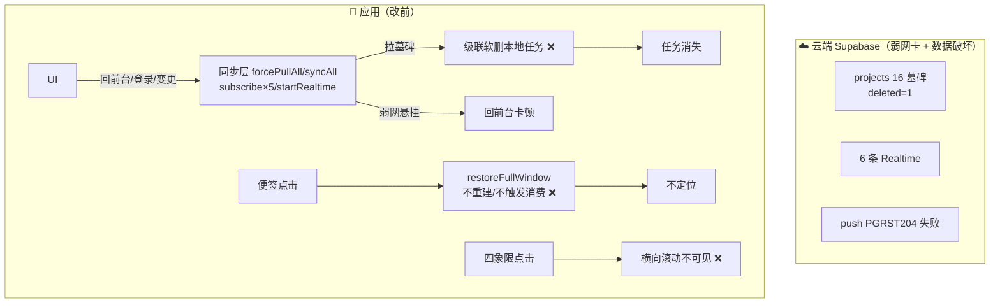
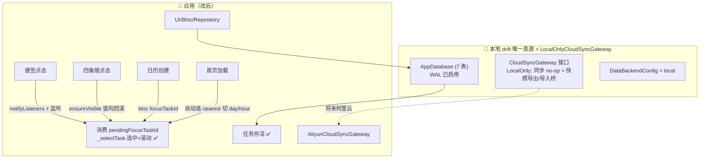

# 变更设计图：断连本地化 + 便签定位修复（PRD 全量，Stage 1-4）

> 类型：workflow + architecture（改前 vs 改后）。触发来源：云端墓碑级联软删 + V3 便签定位失效 + 弱网同步卡顿。
> 影响检查：`gitnexus impact(restoreFullWindow, upstream)` = 0 调用者/LOW；`detect_changes` = 12 文件/3 执行流/medium，无 HIGH/CRITICAL。

## 改前链路（红色 = 被移除的破坏/低效路径）

## 改后链路（绿色 = 保留路径）

## 停用点清单（4 阶段）

| # | 位置 | 停用/新增 |
|---|---|---|
| 1 止血 | `_upsertProjectFromRow` 级联块 | 注释级联软删 |
| 2 架构 | `lib/data/sync/` 3 文件 + connection_native WAL | 新增 gateway 接口/LocalOnly/DataBackend + WAL |
| 3 断连 | 6 sync_service ×22 守卫、home_page 日程 3 处 + `_initStorage`、task_bloc 2 处 | 云操作 no-op、日程本地、Realtime 全停 |
| 4 便签 | controller `restoreFullWindow` + home_page 监听/`_processBlocFocusTask`/`_selectTaskFromQuadrant`/A3 兜底 | A1-A5 定位链路打通 |

## 关键保护（⚠️）
- 重启云同步前必须给级联加"任务 updatedAt > 墓碑 updated_at"保护，否则仍误删墓碑项目下新建任务。
- 日程暂存 SharedPreferences（已 100% 本地）；drift 表迁移 + TaskBreakdown 双轨收敛为后续专项。
