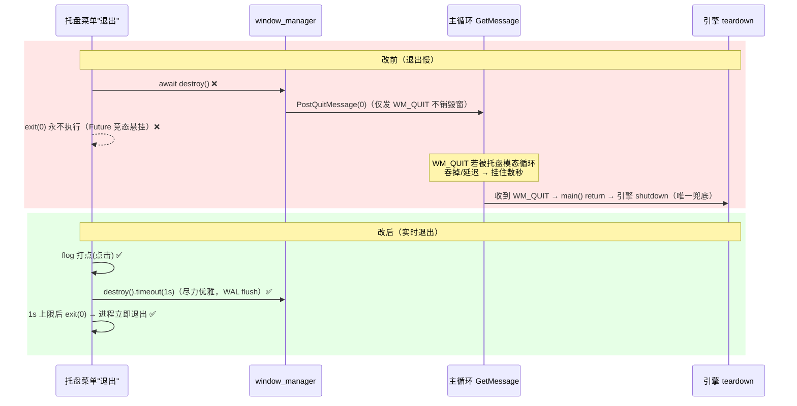
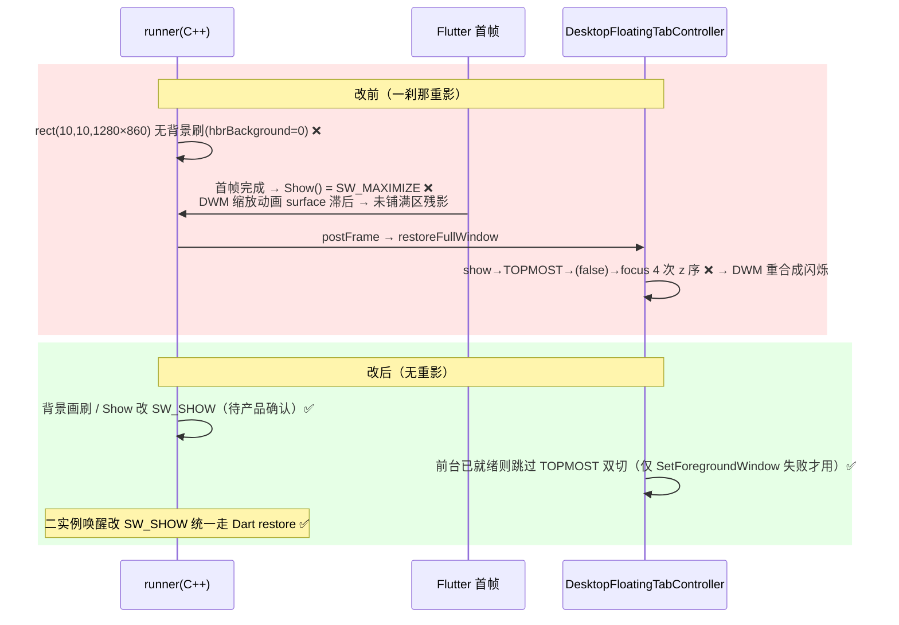

# 变更设计图：第六轮窗口三症状（退出慢 / 便签消失 / 启动重影）

> 类型：sequence（改前 vs 改后时序）。触发来源：任务栏退出慢 + 关主窗→点便签→再关→便签消失 + 启动重影（round6_diagnosis.md 三根因）。
> 影响检查：gitnexus impact 已确认涉及符号均为 LOW 级（`handleCloseRequested`/`restoreFullWindow`/`_showNoteWindow`/`runNoteWindow`/`_initNoteWindowChrome`/`onClicked`/`SingleInstance`），无 HIGH/CRITICAL；C++ runner（main.cpp/win32_window.cpp）改启动显示行为，实机验证为准。

## 症状1：任务栏"退出"（改前 vs 改后）



## 症状2：关主窗→点便签→再关主窗→便签消失（改前 vs 改后）

```mermaid
sequenceDiagram
    participant MAIN as 主窗
    participant NOTE as 便签窗(第二引擎)
    participant CTRL as DesktopFloatingTabController
    rect rgb(255,230,230)
    Note over MAIN,CTRL: 改前（便签消失）
    MAIN->>CTRL: 第1次关主窗 → handleCloseRequested → _showNoteWindow
    CTRL->>NOTE: WindowController.create（hiddenAtLaunch）
    Note over NOTE: 创建→首帧间 setPreventClose 未设（note_window_app:114 太晚）❌
    NOTE->>NOTE: WM_CLOSE 可击穿 → WM_DESTROY → 引擎析构 → registry 移除
    MAIN->>CTRL: 点便签 → showMain → restoreFullWindow
    CTRL->>CTRL: _isTransitioning 竞态 → 早退 return ❌（:157）
    MAIN->>CTRL: 第2次关主窗 → _showNoteWindow 复用路径 note.show()
    CTRL->>NOTE: note.show() 抛 failed to find target window → catch 静默 ❌
    Note over MAIN: 便签不再显示（引擎已销毁）
    end
    rect rgb(230,255,230)
    Note over MAIN,CTRL: 改后（便签常驻可复用）
    NOTE->>NOTE: runNoteWindow 首行即 setPreventClose(true) ✅<br/>+ onWindowClose 兜底只隐藏不销毁
    MAIN->>CTRL: 点便签 → showMain → restoreFullWindow（_isTransitioning 早退改主窗照常 show）✅
    CTRL->>NOTE: note.show() 正常（引擎存活）✅
    Note over MAIN: flog windowId + show 失败含异常 code（可定位）✅
    end
```

## 症状3：启动重影（改前 vs 改后）



## 关键保护（⚠️）
- **L4 实机验证阻塞待办**：三症状均不能无头宣称修复——退出延迟需 flog 计时、便签消失需复现读日志、重影需录屏慢放区分 A/B/C（见 round6_diagnosis.md「L4 实机验证」）。
- **R2-1 是症状2 主修复**：note 引擎创建即 `setPreventClose(true)` + onWindowClose 兜底，根上阻止便签窗被销毁；R2-2 补竞态。
- **R3-1 需产品决策**：Show 改 `SW_SHOW` 会改变启动窗口尺寸（非最大化），保守方案是仅加背景画刷；实机录屏区分 A/B/C 后再定。
- **不回归第五轮成果**：R3-2 保留冷启动可靠置前台能力（仅在前台已就绪时跳过 TOPMOST）；不影响 P0-A~F 的定位/启动/加载修复。
